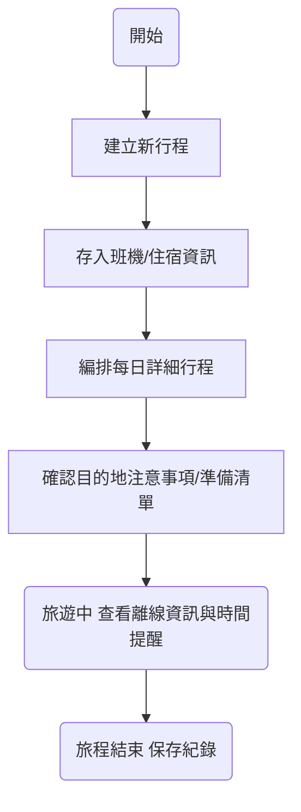

# 產品需求文檔 (PRD) - TripFun

> **文件說明**: 本文件定義了 TripFun 旅遊助手 App 的產品範圍、核心功能與業務流程。

## 1. 專案概述 (Overview)
### 1.1 背景與痛點 (Problem Statement)
*   **現狀**: 用戶在規劃旅遊時，行程往往散落在筆記本、Google 日曆、電子郵件（訂單確認）與 Line 對話紀錄中，缺乏一個能提供「分鐘級精細行程」且同時整合「行前注意事項」與「預約資訊」的一站式工具。
*   **目標**: 打造一款專注於「深度規劃」與「現場輔助」的旅遊 App，讓用戶能輕鬆管理從機票飯店到地鐵出口的每一個細節。
*   **範圍 (Scope)**:
    *   **In-Scope**: 多行程管理、精細時間軸行程、旅行注意事項資料庫、機票/飯店/租車資訊存儲、離線翻譯、單人旅途記帳、目的地時區可視化、**家屬多端實時協作 (多人同步檢視與編輯)**。
    *   **Out-of-Scope**: 分帳系統、社群媒體分享、機票飯店直接訂購。

### 1.2 用戶畫像 (User Personas)
*   **深度規劃者 (Planner)**: 對行程有極高掌控欲，喜歡每一步都先查好，甚至是飯店哪一個出口出站都要記錄。
*   **焦慮型旅人 (Anxious Traveler)**: 擔心忘記帶東西或漏掉搭機細節，需要強大的 Checklist 與行前提醒。

---

## 2. 核心體驗流程 (Core User Flow)
### 2.1 行程管理與規劃

## 3. 功能需求清單 (Functional Requirements)

### 3.1 模組：行程管理 (Trip Management)

| ID | 優先級 | 功能名稱 | User Story | 驗收標準 (AC) |
| :--- | :--- | :--- | :--- | :--- |
| **TRP-01** | P0 | **精細時間軸** | 作為規劃者，我想要以「點對點」的方式記錄時間，以便精確掌控行程。 | 1. 支援 24 小時制時間輸入。 2. 活動可新增備註、地圖座標。 |
| **TRP-02** | P0 | **資訊存儲模組** | 作為旅人，我想要存放班機號碼、登機門、飯店地址，以便快速查看。 | 1. 提供專屬欄位（班機、飯店、租車）。 2. 支援插入截圖。 |
| **TRP-03** | P1 | **目的地百科** | 作為出國者，我想要看到目的地的電壓、簽證、文化禁忌等資訊。 | 1. 根據設定的國家自動顯示預設建議。 2. 用戶可自定義補充。 |

### 3.2 模組：工具與輔助 (Tools & Support)

| ID | 優先級 | 功能名稱 | User Story | 驗收標準 (AC) |
| :--- | :--- | :--- | :--- | :--- |
| **TL-01** | P0 | **離線翻譯** | 作為旅人，我想要在沒網格時輸入文字並翻譯，以便與當地人溝通。 | 1. 支援下載離線字典包。 2. 輸入文字後即時翻譯成選定語言。 |
| **TL-02** | P1 | **旅途記帳** | 作為省錢旅人，我想要記錄每一筆開銷，以便管控預算。 | 1. 支援輸入金額、類別與備註。 2. 顯示當前行程的累計支出。 |
| **TL-03** | P1 | **世界時區鏡** | 作為規劃者，我想要同時看當地與目的地的時間。 | 1. 顯示「所在地時間」與用戶手動添加的「目的地時間」。 2. 支援拖拉排序目的地。 |
| **NOT-01** | P0 | **搭機檢查清單** | *(同前述)* | 1. 內建核心檢查項。 |
| **FAM-01** | P0 | **家屬協作模組** | 作為家庭旅遊發起者，我想要將行程分享給家人，以便大家能同步掌握資訊。 | 1. 支援 UUID 安全連結分享。 2. 分為管理者、檢視者權限。 |

---

## 4. 非功能需求 (Non-Functional Requirements)

1.  **性能 (Performance)**
    *   App 啟動速度需在 2 秒內。
    *   離線模式下需能流暢切換各個已緩存的行程。
2.  **安全性 (Security)**
    *   用戶上傳的護照/證件照片需加密存儲。
3.  **相容性 (Compatibility)**
    *   Flutter (iOS 13+, Android 8.0+)。

---

## 5. 數據指標 (Metrics)
*   **行程完成度**: 用戶平均每個行程記錄的活動數量（目標：> 10 個）。
*   **離線使用率**: 衡量 App 對旅途中無網路環境的幫助。

## 6. 專案時程 (Roadmap)
*   **Phase 1 (MVP)**: 基礎行程編輯、班機/飯店資料存放、靜態注意事項資料庫。
*   **Phase 2**: 圖片 OCR 自動解析資訊、Google Maps 位置選取、多人協作模式。

