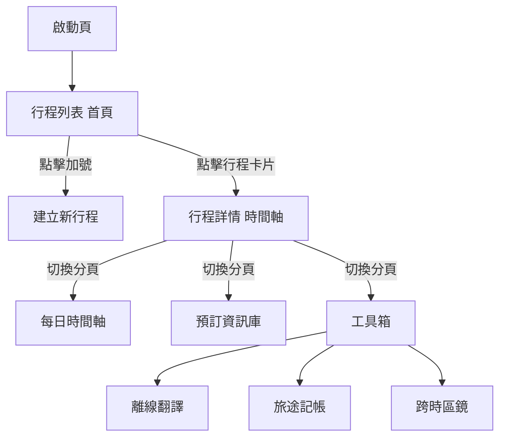
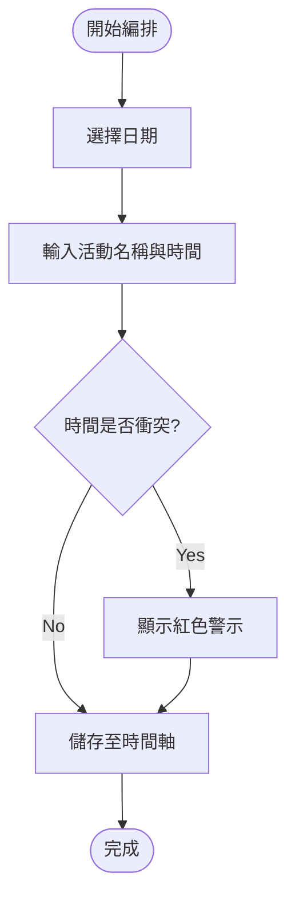
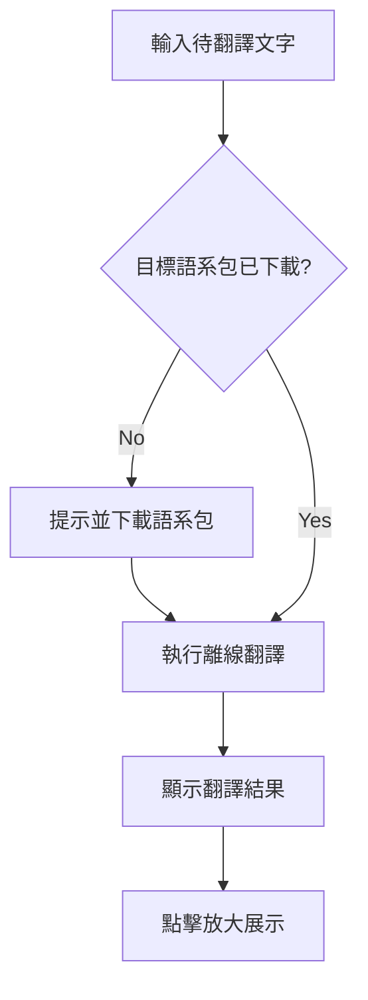
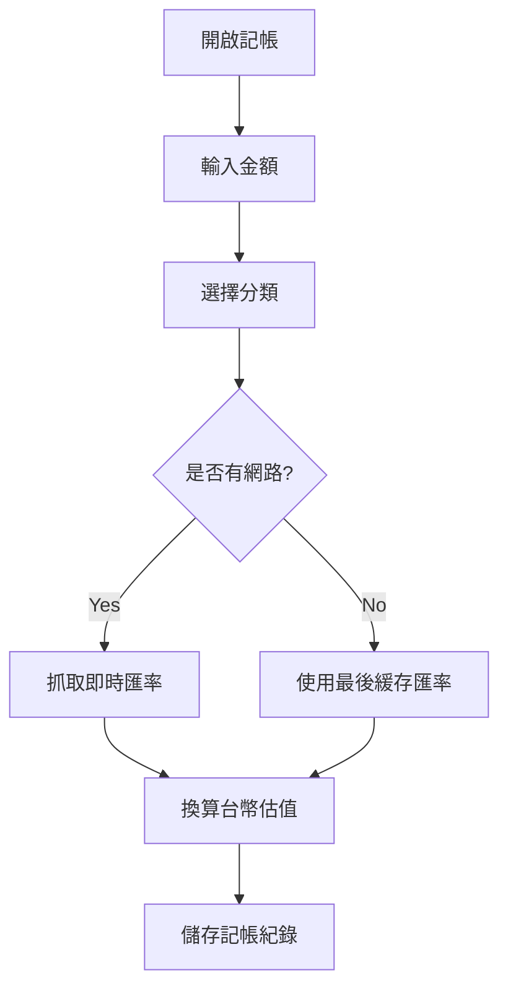
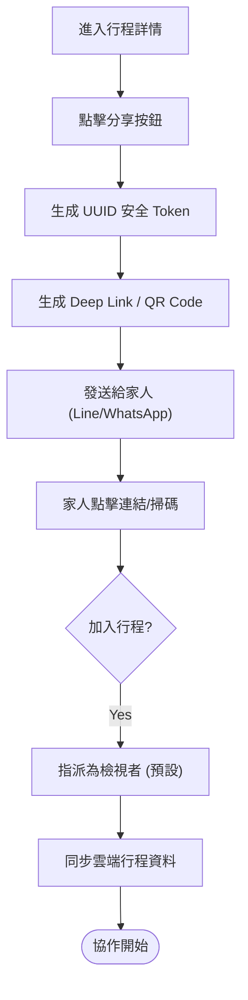

# 核心業務流程圖

> **說明**: 本文件使用 Mermaid 語法繪製 TripFun App 的核心操作流程。

## 1. 核心導覽流 (Main Navigation)

---

## 2. 行程編排流程 (Itinerary Planning Flow)

---

## 3. 離線翻譯流程 (Offline Translation Flow)

---

## 4. 旅途記帳流程 (Expense Tracking Flow)

---

## 5. 家屬協作共享流程 (Family Collaboration Flow)

