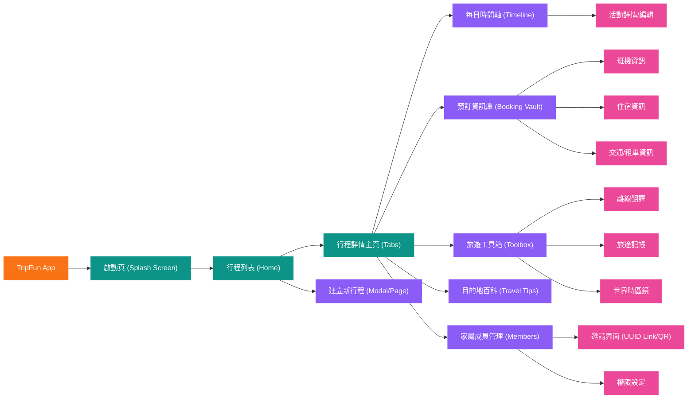

# 前台頁面結構 (Frontend App Structure)

> **說明**: 本圖表呈現 TripFun 行動端 App 的頁面層級與導覽關係。建議使用支援 Mermaid 預覽的編輯器查看。

```mermaid
graph LR
    %% 節點定義
    Root[TripFun App]:::level1
    
    %% 第一層子節點
    Splash["啟動頁 (Splash Screen)"]:::level2
    Home["行程列表 (Home)"]:::level2
    TripContainer["行程詳情主頁 (Tabs)"]:::level2
    
    %% 第二層子節點 (Home)
    CreateTrip["建立新行程 (Modal/Page)"]:::level3
    
    %% 第二層子節點 (TripContainer)
    Timeline["每日時間軸 (Timeline)"]:::level3
    Booking["預訂資訊庫 (Booking Vault)"]:::level3
    Toolbox["旅遊工具箱 (Toolbox)"]:::level3
    Tips["目的地百科 (Travel Tips)"]:::level3
    Members["家屬成員管理 (Members)"]:::level3
    
    %% 第三層子節點 (Members)
    Invite["邀請界面 (UUID Link/QR)"]:::level4
    RoleSet["權限設定"]:::level4
    
    %% 第三層子節點 (Timeline)
    ActDetail["活動詳情/編輯"]:::level4
    
    %% 第三層子節點 (Booking)
    FlightDetail["班機資訊"]:::level4
    StayDetail["住宿資訊"]:::level4
    TransportDetail["交通/租車資訊"]:::level4
    
    %% 第三層子節點 (Toolbox)
    TransTool["離線翻譯"]:::level4
    AccountTool["旅途記帳"]:::level4
    TZTool["世界時區鏡"]:::level4

    %% 關聯關係
    Root --> Splash
    Splash --> Home
    Home --> CreateTrip
    Home --> TripContainer
    
    TripContainer --> Timeline
    TripContainer --> Booking
    TripContainer --> Toolbox
    TripContainer --> Tips
    TripContainer --> Members
    
    Timeline --> ActDetail
    Booking --> FlightDetail
    Booking --> StayDetail
    Booking --> TransportDetail
    
    Toolbox --> TransTool
    Toolbox --> AccountTool
    Toolbox --> TZTool

    Members --> Invite
    Members --> RoleSet

    %% 樣式定義
    classDef level1 fill:#f97316,stroke:none,color:white;
    classDef level2 fill:#0d9488,stroke:none,color:white;
    classDef level3 fill:#8b5cf6,stroke:none,color:white;
    classDef level4 fill:#ec4899,stroke:none,color:white;
```
