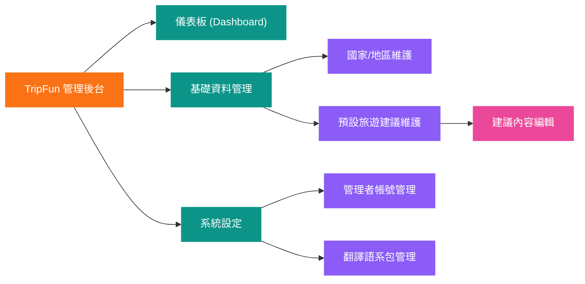

# 後台頁面結構 (Backend Admin Structure)

> **說明**: 本圖表呈現 TripFun 管理系統的頁面層級。建議使用支援 Mermaid 預覽的編輯器查看。

```mermaid
graph LR
    %% 節點定義
    Root[TripFun 管理後台]:::level1
    
    %% 第一層子節點
    Dashboard["儀表板 (Dashboard)"]:::level2
    DataMgmt["基礎資料管理"]:::level2
    SysMgmt["系統設定"]:::level2
    
    %% 第二層子節點 (DataMgmt)
    CountryMgmt["國家/地區維護"]:::level3
    TipMgmt["預設旅遊建議維護"]:::level3
    
    %% 第二層子節點 (SysMgmt)
    UserMgmt["管理者帳號管理"]:::level3
    LangMgmt["翻譯語系包管理"]:::level3
    
    %% 第三層子節點 (DataMgmt)
    TipEdit["建議內容編輯"]:::level4

    %% 關聯關係
    Root --> Dashboard
    Root --> DataMgmt
    Root --> SysMgmt
    
    DataMgmt --> CountryMgmt
    DataMgmt --> TipMgmt
    
    SysMgmt --> UserMgmt
    SysMgmt --> LangMgmt
    
    TipMgmt --> TipEdit

    %% 樣式定義
    classDef level1 fill:#f97316,stroke:none,color:white;
    classDef level2 fill:#0d9488,stroke:none,color:white;
    classDef level3 fill:#8b5cf6,stroke:none,color:white;
    classDef level4 fill:#ec4899,stroke:none,color:white;
```
